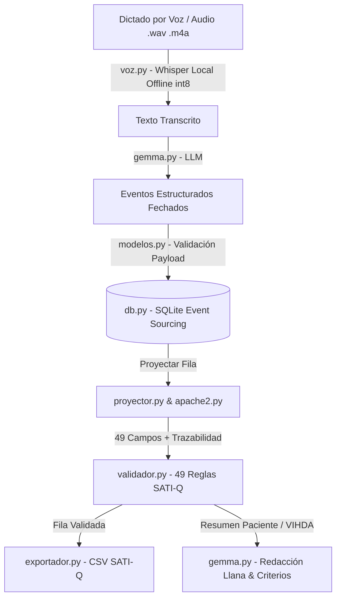

# 🩺 MedTranscriptor - Sistema de Registro Inteligente para Terapia Intensiva (UCI / SATI-Q)

[](https://www.python.org/)
[](https://streamlit.io/)
[](https://pywebview.flowrl.com/)
[](https://github.com/SYSTRAN/faster-whisper)
[](https://ai.google.dev/)
[](https://sati.org.ar/)

> **MedTranscriptor** es una plataforma para Unidades de Cuidados Intensivos (UCI) que registra la internación del paciente día a día mediante **Event Sourcing inmutable**. Permite el dictado directo por voz mediante **Whisper local offline**, y al egreso genera automáticamente y en tiempo real la fila de reporte oficial de **49 campos** para el registro nacional **SATI-Q** (Argentina), validada, trazable punto a punto y acompañada de un resumen en lenguaje llano para el paciente y su familia. Se ejecuta tanto como **aplicación de escritorio nativa** (`pywebview`) como en interfaz web (`Streamlit`).

---

## 📋 Tabla de Contenidos

- [1. Descripción General](#1-descripción-general)
- [2. Estructura del Repositorio](#2-estructura-del-repositorio)
- [3. Instalación y Entorno](#3-instalación-y-entorno)
- [4. Pipeline y Flujo de Trabajo](#4-pipeline-y-flujo-de-trabajo)
- [5. Decisiones Técnicas Clave](#5-decisiones-técnicas-clave)
- [6. Resultados Principales y Demos](#6-resultados-principales-y-demos)
- [7. Reproducción del Análisis desde Cero](#7-reproducción-del-análisis-desde-cero)
- [📄 Arquitectura Detallada](#-arquitectura-detallada)

---

## 1. Descripción General

### El Problema Real
En Argentina, las Unidades de Cuidados Intensivos adheridas al programa nacional de calidad **SATI-Q** (Sociedad Argentina de Terapia Intensiva) deben reportar una planilla con **49 campos estandarizados** por cada paciente egresado. Estos campos incluyen:
- Días de uso de dispositivos invasivos (Ventilación Invasiva `VI`, Ventilación No Invasiva `VNI`, Cánula de Alto Flujo `CAFO`, Catéter Venoso Central `CVC`, Sonda Vesical `SV`, Sonda Enteral `SE`, Sonda Nasogástrica `SNG`).
- Eventos adversos e infecciones (Neumonía NAV, Infección por Catéter, Infección Urinaria, Escaras, Autoextubaciones, etc.).
- Scores fisiológicos y de carga asistencial de gravedad (**APACHE II** y **TISS-28**).

Tradicionalmente, esta planilla se confecciona **manualmente al momento del egreso**, reconstruyendo datos desde la historia clínica en papel o digital. Este proceso consume horas de médicos y enfermeros, introduce errores aritméticos/de memoria y carece de mecanismos para auditar de qué nota o timestamp proviene cada valor.

### La Solución MedTranscriptor
MedTranscriptor implementa la metáfora de un **resumen bancario**:
- En lugar de registrar el "saldo final" a mano al egreso, el sistema almacena **los movimientos diarios** (eventos fechados inmutables).
- La fila oficial de **49 campos nunca se almacena en la base de datos**; se proyecta en tiempo real calculando la aritmética de los eventos registrados.
- Cada número resultante es 100% auditable y trazable hasta el evento clínico originario con su autor, fecha y cita textual.

### División de Responsabilidades (Regla de Oro)
- **Speech-to-Text (`voz.py` con `faster-whisper`)**: Convierte notas de audio dictadas en vivo por el médico a texto en español de manera 100% local y offline en la CPU de la computadora, sin enviar audio a servidores externos.
- **Gemma (Google LLM - `gemma-4-26b-a4b-it`)**: Se encarga de comprender el lenguaje médico natural. Traduce notas dictadas a eventos estructurados fechados, audita evidencias según el manual VIHDA y redacta la explicación final en lenguaje sencillo para los familiares.
- **Python Determinista**: Realiza **todos** los cálculos matemáticos (conteo de días de dispositivos, cálculo de estadía, cálculo del score APACHE II peor valor en 24h, promedios TISS-28, validación de reglas SATI-Q y exportación CSV). *Gemma NUNCA suma, cuenta días ni calcula scores.*

### Datasets y Referencias Incorporadas
1. **Especificaciones SATI-Q 2026** ([`EDS V2026 SATI-Q.xlsx - Anexo A1.csv`](file:///c:/Users/Pc/Desktop/Gemma/MedTranscriptor/EDS%20V2026%20SATI-Q.xlsx%20-%20AnexoA1.csv) a [`Anexo A4.csv`](file:///c:/Users/Pc/Desktop/Gemma/MedTranscriptor/EDS%20V2026%20SATI-Q.xlsx%20-%20Anexo%20A4.csv)): Tablas oficiales de referencia de variables y la estructura exacta del header de 49 columnas (~22 KB).
2. **Esquemas JSON** (`schema/`):
   - [`schema/satiq_campos.json`](file:///c:/Users/Pc/Desktop/Gemma/MedTranscriptor/schema/satiq_campos.json): Definición de los 49 campos y sus 49+ reglas de validación (tipos, rangos, condicionales).
   - [`schema/apache2.json`](file:///c:/Users/Pc/Desktop/Gemma/MedTranscriptor/schema/apache2.json): Rangos de puntuación fisiológica, oxigenación PaO2/A-aDO2 y ecuación de regresión de Knaus.
   - [`schema/eventos.json`](file:///c:/Users/Pc/Desktop/Gemma/MedTranscriptor/schema/eventos.json): Contrato estricto de tipos de eventos y esquemas de payload JSON.
   - [`schema/vihda_criterios.json`](file:///c:/Users/Pc/Desktop/Gemma/MedTranscriptor/schema/vihda_criterios.json): Criterios oficiales de vigilancia epidemiológica VIHDA para infecciones intrahospitalarias.
3. **Paciente Sintético de Prueba** ([`semilla.py`](file:///c:/Users/Pc/Desktop/Gemma/MedTranscriptor/semilla.py)): Episodio clínico inventado (62 años, sepsis respiratoria) con 7 notas de evolución médica preparadas para probar casos bordes reales (2 CVC simultáneos, fechas relativas "ayer/el martes", autoextubación, escara sacra y corrección de registros).
4. **Privacidad de Datos**: No se utilizan ni exponen datos reales de pacientes. El CSV de SATI-Q es anónimo por diseño (`IDCENTRO` hash, `IDPACIENTE` secuencial). La transcripción de voz es local (Whisper) y el modelo Gemma puede correrse de forma 100% local a través de Ollama.

---

## 2. Estructura del Repositorio

```text
MedTranscriptor/
├── MedTranscriptor.py         # Lanzador principal de la app en ventana de escritorio nativa (pywebview / Streamlit)
├── voz.py                     # Módulo de transcripción local offline de voz con faster-whisper (modelo small en CPU int8)
├── probar_voz.py              # Script CLI para validar la cadena completa: Audio -> Whisper -> Gemma -> SQLite BD
├── app.py                     # Interfaz web/escritorio interactiva en Streamlit (Grabar voz, Revisar, Fila SATI-Q)
├── gemma.py                   # Cliente e integración del modelo Gemma 4 (Google AI Studio / Ollama)
├── proyector.py               # Motor determinista de proyección de los 49 campos de SATI-Q y trazabilidad
├── apache2.py                 # Algoritmo de cálculo de APACHE II (peor valor 24h) y probabilidad de mortalidad
├── validador.py               # Validador de reglas clínicas y de formato sobre la fila proyectada SATI-Q
├── exportador.py              # Exportador de la fila validada a formato CSV oficial SATI-Q (delimitador ;)
├── db.py                      # Capa de persistencia SQLite de arquitectura Event Sourcing (Insert-Only)
├── modelos.py                 # Dataclasses de Episodio, Evento y esquemas de validación de payloads
├── semilla.py                 # Datos del paciente sintético de prueba y las 7 notas de evolución clínica
├── demo.py                    # Script CLI end-to-end para ejecutar y validar la demo completa (con caché)
├── CONTEXT.txt                # Documento original con las reglas de negocio y restricciones del proyecto
├── .env.example               # Plantilla de variables de entorno (API Keys, Backend, Modelo)
├── medtranscriptor.db         # Base de datos SQLite local (creada en ejecución)
├── schema/                    # Definiciones JSON y contratos de validación
│   ├── apache2.json           # Tablas de rangos y ponderación para el cálculo de APACHE II
│   ├── eventos.json           # Schema JSON de tipos de eventos y payloads admitidos
│   ├── satiq_campos.json      # Especificación completa de los 49 campos de la planilla SATI-Q
│   └── vihda_criterios.json   # Criterios del programa VIHDA para auditar evidencia de infecciones
├── demo/                      # Artefactos y caché de demostración
│   ├── eventos_cache.json     # Caché de eventos extraídos por Gemma para pruebas offline instantáneas
│   ├── vihda_cache.json       # Caché precalculado para auditoría de evidencia epidemiológica VIHDA
│   ├── salida_satiq.csv       # Archivo CSV generado por la demo oficial
│   └── audio/                 # Almacenamiento de notas de voz dictadas/probadas
├── docs/                      # Documentación técnica avanzada
│   └── ARCHITECTURE.md        # Especificación detallada de arquitectura, schemas e ingeniería de prompts
└── EDS V2026 SATI-Q.xlsx - Anexo*.csv # Archivos de referencia oficiales del estándar SATI-Q 2026
```

---

## 3. Instalación y Entorno

### Requisitos Previos
- Python 3.10 o superior.
- Git (opcional).
- API Key de Google AI Studio (si se usa el backend en la nube) u Ollama (si se usa localmente).

### Pasos de Instalación

1. **Clonar / Ubicarse en el directorio del proyecto:**
   ```bash
   cd c:\Users\Pc\Desktop\Gemma\MedTranscriptor
   ```

2. **Crear y activar un entorno virtual de Python:**
   - **En Windows (PowerShell / CMD):**
     ```powershell
     python -m venv .venv
     .venv\Scripts\activate
     ```
   - **En Linux / macOS:**
     ```bash
     python3 -m venv .venv
     source .venv/bin/activate
     ```

3. **Instalar dependencias del proyecto:**
   ```bash
   pip install streamlit faster-whisper pywebview
   ```
   - `streamlit`: Servidor de la interfaz gráfica e interacción clínica.
   - `faster-whisper`: Reconocimiento y transcripción de voz a texto 100% offline.
   - `pywebview` *(opcional pero recomendado)*: Contenedor para abrir MedTranscriptor como aplicación nativa de escritorio sin mostrar barras del navegador.

4. **Configurar el archivo de entorno `.env`:**
   Copiar la plantilla `.env.example` a `.env`:
   ```bash
   copy .env.example .env
   ```
   Editar `.env` e ingresar las credenciales:
   ```ini
   GOOGLE_AI_API_KEY=tu_api_key_de_google_ai_studio
   GEMMA_MODEL=gemma-4-26b-a4b-it
   GEMMA_BACKEND=google
   GEMMA_THINKING=high
   WHISPER_MODELO=small
   ```

---

## 4. Pipeline y Flujo de Trabajo

El flujo de información en MedTranscriptor sigue un pipeline rigurosamente desacoplado:



### Etapas del Pipeline

1. **Ingreso Administrativo (`Episodio`)**: Se registran al ingreso los datos fijos del paciente (Edad, Sexo, Procedencia, Motivo de Ingreso, Antecedentes Crónicos).
2. **Transcripción por Voz Offline (`voz.py`)**: El profesional dicta el parte médico. `faster-whisper` procesa el audio localmente en la CPU (utilizando cuantización `int8` y filtro de actividad de voz VAD para descartar silencios) y genera el texto en español.
3. **Estructuración y Extracción por Gemma (`gemma.py`)**: Gemma analiza la nota transcripta en el contexto de la fecha de referencia y la lista de dispositivos previamente colocados (`instancias_abiertas`). Extrae los eventos clínicos estructurados (`dispositivo_inicio`, `dispositivo_fin`, `fisiologico_24h`, `evento_adverso`, `tiss_diario`, `egreso`).
4. **Inserción Inmutable en Event Store (`db.py`)**: Si la confianza del evento es `< 0.75`, se marca para revisión humana en la UI. Los eventos se guardan en SQLite mediante sentencias `INSERT` estrictas (sin `UPDATE` ni `DELETE`).
5. **Proyección Determinista (`proyector.py`)**: Se leen todos los eventos vigentes del episodio y se calculan determinísticamente los 49 campos SATI-Q. Cada campo incluye los `evento_ids` originarios para la auditoría de trazabilidad.
6. **Cálculo de Gravamen APACHE II (`apache2.py`)**: Se analizan los eventos de las primeras 24 horas. Para cada una de las 12 variables fisiológicas se determina el peor valor (máximo puntaje de alteración). Se calcula el score final y la probabilidad de muerte asociada (Knaus).
7. **Validación de Integridad (`validador.py`)**: Se contrasta la fila proyectada contra las reglas clínicas y de formato del estándar SATI-Q 2026.
8. **Exportación e Informes (`exportador.py` / `gemma.py`)**: Si no hay errores, se genera el CSV con delimitador `;`. Gemma puede redactar un informe sin jerga médica para los familiares o verificar evidencias contra el manual epidemiológico VIHDA.

---

## 5. Decisiones Técnicas Clave

Inferidas directamente del código fuente y los comentarios del desarrollo:

1. **Lanzador de Escritorio y Manejo Dinámico de Puertos (`MedTranscriptor.py`)**:
   - *Por qué*: Para brindar la experiencia de una aplicación nativa de hospital sin requerir que el usuario abra la terminal o ingrese una dirección IP/puerto. Busca automáticamente un puerto libre en `127.0.0.1` mediante un socket temporal para evitar colisiones con instancias colgadas. Utiliza `pywebview` (motor WebView2/Edge en Windows) con fallback automático al navegador con el flag `--navegador`.
2. **Transcripción Local Offline con Whisper (`voz.py`)**:
   - *Por qué*: Garantiza privacidad absoluta (el audio con voz del médico nunca viaja por internet) y minimiza latencias. Se seleccionó el modelo `small` cuantizado a `int8` en CPU con `vad_filter=True` para permitir ejecuciones veloces incluso en procesadores de gama media sin tarjeta gráfica dedicada (ej. Intel Core i5).
3. **Script de Verificación End-to-End de Voz (`probar_voz.py`)**:
   - *Por qué*: Permite probar la integración completa desde un archivo de voz real (grabado con la Grabadora de Voz de Windows o celular) hasta la inserción de eventos en SQLite (`--guardar`), respaldando copias del audio en `demo/audio/`.
4. **Arquitectura Event Sourcing (Inmutabilidad Estricta en `db.py`)**:
   - *Por qué*: En registros clínicos es crítico el audit trail. No existen sentencias `UPDATE` ni `DELETE`. Las correcciones se realizan insertando un evento posterior que contiene `corrige_a_evento_id`. El proyector filtra automáticamente los eventos obsoletos.
5. **Proyección al Vuelo (Sin almacenamiento de la fila SATI-Q)**:
   - *Por qué*: Si se guardaran los 49 campos en una tabla, corregir una nota histórica requeriría recalcular y actualizar columnas manualmente. Al proyectar al vuelo a partir de los eventos, la fila reflejada siempre es coherente con el historial.
6. **Selección del Peor Valor en APACHE II (`apache2.py`)**:
   - *Por qué*: Tomar el valor numérico "máximo" o "mínimo" es erróneo en variables bidireccionales (ej. temperatura: 33°C y 41°C son graves, 37°C es normal). El algoritmo calcula los puntos de gravedad de cada medición y selecciona el evento de mayor puntaje.
7. **Estrategia con el Modelo Gemma 4 (`gemma.py`)**:
   - *Model Thinking Level (`high`)*: Se determinó empíricamente que reducir el nivel de razonamiento a `minimal` introducía confusiones graves entre variables clínicas (ej. mapear creatinina a leucocitos). Se forzó `GEMMA_THINKING=high` para garantizar máxima exactitud.
   - *Parseo y Normalización Post-Inferencia*: Pese a guiar al modelo por JSON Schema en el prompt, Gemma puede incluir claves de otros tipos de eventos. Se implementó la función `_normalizar_payload()` en Python para limpiar atributos espurios sin depender del comportamiento del LLM.

---

## 6. Resultados Principales y Demos

### 1. Aplicación de Escritorio Nativa (`MedTranscriptor.py`)
Permite lanzar el sistema completo en una ventana nativa de escritorio independiente:
```bash
python MedTranscriptor.py
```
Si se prefiere abrir directamente en el navegador por omisión de permisos de micrófono en WebView:
```bash
python MedTranscriptor.py --navegador
```

### 2. Prueba CLI de Dictado por Voz (`probar_voz.py`)
Permite tomar una nota de voz recién grabada (ej. `nota_uci.m4a` o `.wav`), transcribirla localmente con Whisper, procesarla con Gemma e insertarla en la base de datos SQLite:
```bash
python probar_voz.py "C:\Ruta\A\Tu\grabacion.m4a" --guardar
```

### 3. Ejecución CLI de Demostración con Caché (`demo.py`)
El repositorio incluye un script autocontenido que procesa las 7 notas sintéticas de la demo y genera el reporte SATI-Q con soporte de caché offline tanto para eventos como para criterios VIHDA (`demo/vihda_cache.json`):
```bash
python demo.py --cache
```

### 4. Interfaz Gráfica Streamlit (`app.py`)
La aplicación web/escritorio ofrece 3 pestañas de interacción clínica:
- **Pestaña 1 (Grabar Evolución)**: Captura de voz desde el micrófono (vía Whisper local), pegado de texto o carga de notas sintéticas.
- **Pestaña 2 (Qué se anotó)**: Timeline interactivo de eventos, resaltando tarjetas amarillas cuando la confianza es `< 0.75` para revisión del profesional.
- **Pestaña 3 (Fila SATI-Q en Cristiano)**: Vista de los 49 campos proyectados en 7 secciones clínicas, trazabilidad punto a punto vía ventanas *popover*, validación instantánea de 49+ reglas, descarga de CSV oficial y verificación de evidencia epidemiológica VIHDA.

---

## 7. Reproducción del Análisis desde Cero

Para reproducir el sistema desde la terminal:

### Opción A: Lanzar la Aplicación de Escritorio (Modo Recomendado)

```bash
python MedTranscriptor.py
```

### Opción B: Probar la Transcripción de una Nota de Voz Real

```bash
python probar_voz.py mi_nota_dictada.wav --guardar
```

### Opción C: Ejecutar la Demo CLI Offline

```bash
python demo.py --cache
```

### Opción D: Levantar Servidor Streamlit Tradicional

```bash
streamlit run app.py
```
Acceder a `http://localhost:8501`.

---

## 📄 Arquitectura Detallada

Para una profundización técnica sobre los esquemas de datos, el motor de voz con Whisper, la lógica del proyector, los algoritmos de APACHE II y la integración de Gemma 4, consultar la documentación en:

👉 **[docs/ARCHITECTURE.md](file:///c:/Users/Pc/Desktop/Gemma/MedTranscriptor/docs/ARCHITECTURE.md)**

---

*MedTranscriptor - Desarrollado para el registro eficiente, transparente y auditable en Unidades de Cuidados Intensivos.*
