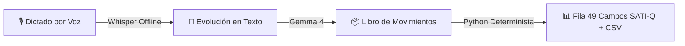

# 🩺 MedTranscriptor
### *Del dictado médico al reporte oficial SATI-Q en segundos. Sin tipeo manual, con 100% de trazabilidad clínica.*

[](https://www.python.org/)
[](https://streamlit.io/)
[](https://pywebview.flowrl.com/)
[](https://github.com/SYSTRAN/faster-whisper)
[](https://ai.google.dev/)
[](https://sati.org.ar/)

---

## 🚀 ¿Qué es MedTranscriptor?

En las **Unidades de Cuidados Intensivos (UCI)** de Argentina, cada egreso requiere llenar manualmente una planilla de **49 campos** para el registro nacional de calidad **SATI-Q** (días de respirador, catéteres, sondas, infecciones y scores de gravedad como APACHE II). 

Hoy esto se llena a mano reconstruyendo días de historia clínica: **consume horas del personal, genera errores y no se puede auditar.**

**MedTranscriptor** cambia las reglas del juego mediante la metáfora de un **resumen bancario**:
1. El médico **dicta por voz** o escribe la evolución médica diaria.
2. **Gemma 4** extrae los hechos clínicos como **movimientos diarios fechados e inmutables** (*Event Sourcing*).
3. **Python determinista** proyecta automáticamente la planilla de **49 campos SATI-Q**, calcula días, estadías y APACHE II sin margen de error, manteniendo **trazabilidad de cada número hasta la cita textual del médico**.

---

## ✨ Características Principales

| Función | Descripción | Beneficio |
| :--- | :--- | :--- |
| 🎙️ **Dictado por Voz Local** | Transcripción 100% offline con `faster-whisper` cuantizado en CPU (`int8`). | Privacidad absoluta, sin envío de audio a internet y respuesta inmediata. |
| 🤖 **Estructuración con Gemma 4** | Traducción de lenguaje médico natural a eventos clínicos normativos. | El médico habla como siempre; el sistema entiende fechas relativas y dispositivos. |
| ⚡ **Event Sourcing Inmutable** | Los datos se guardan como eventos *Insert-Only*. Sin sentencias `UPDATE` ni `DELETE`. | Auditoría histórica inalterable. Las correcciones quedan registradas de forma transparente. |
| 🧮 **Aritmética Determinista** | Python realiza el cálculo exacto de días, estadía, peor valor APACHE II y TISS-28. | **Gemma NUNCA calcula**. Cero alucinaciones numéricas en registros críticos. |
| 🔍 **Trazabilidad Punto a Punto** | El usuario clickea cualquier número del reporte y ve qué nota, fecha y autor lo originó. | Transparencia total ante auditorías médicas o comités de calidad. |
| 🛡️ **Validación SATI-Q & VIHDA** | Verificación de 49+ reglas del estándar SATI-Q 2026 y criterios epidemiológicos VIHDA. | Reportes libres de errores de formato o inconsistencias clínicas. |
| 👨‍👩‍👧‍👦 **Informe para la Familia** | Redacción automática de resúmenes de egreso en lenguaje llano sin jerga médica. | Comunicación clara y empática con familiares. |
| 💻 **App Nativa de Escritorio** | Lanzamiento en 1 clic como app de escritorio nativa (`pywebview`) o en el navegador. | Experiencia de usuario limpia e integrables a estaciones de enfermería/médicos. |

---

## 🔄 Flujo de Trabajo en 4 Pasos



1. **Dictar**: El médico graba o escribe la evolución del día al pasar visita.
2. **Revisar**: El sistema muestra los eventos comprendidos. Si la confianza es menor a `0.75`, solicita confirmación humana.
3. **Proyectar**: Al egreso, Python calcula automáticamente los 49 campos oficiales sin que nadie cargue un solo número a mano.
4. **Exportar**: Descarga del CSV oficial del estándar SATI-Q 2026 y generación del informe para la familia.

---

## ⚡ Inicio Rápido (Quick Start)

### 1. Clonar e instalar dependencias

```bash
git clone https://github.com/Zertyens/MedTranscriptor.git
cd MedTranscriptor

python -m venv .venv
# En Windows: .venv\Scripts\activate | En Linux/macOS: source .venv/bin/activate

pip install streamlit faster-whisper pywebview
```

### 2. Configurar credenciales (`.env`)

Copiar `.env.example` a `.env` e ingresar tu clave de Google AI Studio:

```ini
GOOGLE_AI_API_KEY=tu_api_key_de_google_ai_studio
GEMMA_MODEL=gemma-4-26b-a4b-it
GEMMA_BACKEND=google
GEMMA_THINKING=high
```

### 3. Iniciar MedTranscriptor

```bash
# Modo Aplicación de Escritorio Nativa (Recomendado):
python MedTranscriptor.py

# Modo Demo CLI Offline (Instantáneo sin consumo de API):
python demo.py --cache
```

---

## 📊 Demostración en Consola

```text
==============================================================================
3. FILA SATI-Q PROYECTADA (Python calcula, nadie carga estos números)
==============================================================================
  ESTADIA       = 7          (1 eventos)
  SCORE         = 41         (11 eventos)  [APACHE II peor valor en 24h]
  PROBABMORT    = 92.19      (11 eventos)
  VI            = 1          (1 eventos)
  DIASVI        = 5          (2 eventos)
  CVC           = 1          (2 eventos)
  DIASCVC       = 10         (4 eventos)   [2 catéteres simultáneos]
  NEUMONIA      = 1          (1 eventos)
  RESULTADO     = 1          (1 eventos)

==============================================================================
4. TRAZABILIDAD (Clic en DIASCVC = 10 para auditar origen)
==============================================================================
  DIASCVC = 10 sale de:
    - 2025-03-02 09:00 | Dra. Pereyra: 'le coloque una via central subclavia derecha'
    - 2025-03-08 11:00 | Dra. Pereyra: 'Le retiro la central subclavia'
    - 2025-03-02 15:00 | Dra. Pereyra: 'tuve que poner una segunda central yugular'
    - 2025-03-04 12:00 | Dr. Molina:   'Le saque la central yugular'
```

---

## 📚 Documentación Técnica Detallada

Para consultar el manual de usuario completo, especificaciones de arquitectura y algoritmos:

- 📘 **[Manual y Documentación Completa](docs/DOCUMENTATION.md)**: Guía detallada del usuario, instalación y reproducción del pipeline.
- 📐 **[Arquitectura Técnica y Algoritmos](docs/ARCHITECTURE.md)**: Schemas de datos, contrato JSON, motor de proyección, algoritmos APACHE II e ingeniería de prompts de Gemma 4.

---

*MedTranscriptor - Innovación y precisión al servicio de la medicina intensiva.*
